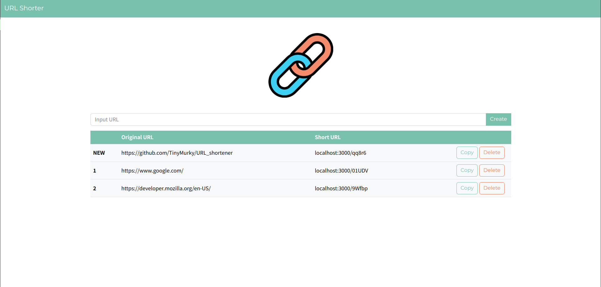
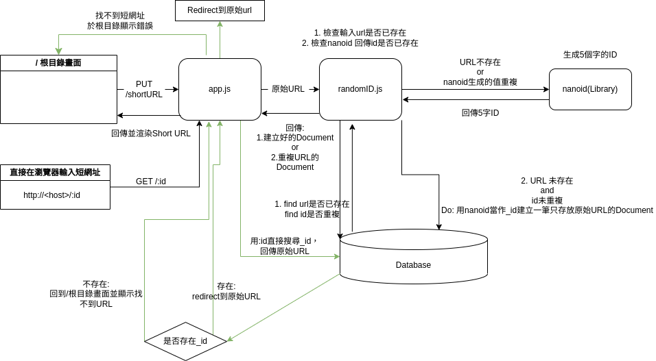

# Readme


## Installing - 專案安裝流程

1. 請先確認有安裝 node.js 與 npm
2. 創造一個專案資料夾，打開您的 terminal，使用`cd`指令進入您剛創建的資料夾
3. Clone 此專案至本機電腦將專案 clone 到本地
    ```bash
    git clone https://github.com/TinyMurky/URL_shortener.git
    ```
4. 在本地開啟之後，透過終端機進入資料夾，輸入：
    ```bash
    npm install
    ```
5. 我們需要連結到MongoDB，您需要先於[MongoDB](https://www.mongodb.com/)建立您的Cluster，並於畫面左上角的Database=>Connect 取得雲端DB連結。

    
6. 建立Cluster後，在本專案的根目錄中建立`.env`檔案，並於檔案中填入從第5步連結中的資料(不用留`<>`)
    ```bash
    MONGODB_USER=<您的用戶名>
    MONGODB_PASSWORD=<您的密碼>
    MONGODB_CLUSTER=<您的Cluster連結> (ex:taiwancluster.3pkhs7h.mongodb.net)
    MONGODB_REPO=url_shorter
    ```

7. 建立完後，於終端機輸入：
    ```bash
    npm run start
    ```
8. 若看見此行訊息則代表順利運行，打開瀏覽器進入到以下網址:
    ```bash
    Server http://localhost:3000 started.
    ```
9. 若欲暫停請於終端機使用:
    ```bash
    ctrl + c
    ```

## 程式邏輯

1.  從主畫面取得原始URL
2.  檢查原始URL是否已存在，若已存在，在主畫面顯示上次產生的短網址
3.  如果不存在，使用套件nanoid產生5字id，重複產生id直到產生資料庫未使用過的id
4.  使用nanoid當作資料庫的_id，並儲存原始URL於此_id之下
5.  使用nanoid當作短網址縮碼，回傳主畫面
6.  當使用者輸入短網址，用短網址 `/:id` 的部份，進入資料庫查詢`_id`
7.  若存在此`_id`，將畫面轉移至原始URL的網頁
8.  如果不存在此`_id`，畫面轉移致主畫面並寫是不存在此短網址
## 例外處理
### 輸入相同網址時，產生一樣的縮址
1.  /plugins/randomID.js
    在創立一筆資料前會先於資料庫尋找是否已存在相同的URL，如果有則直接回傳已存在的Short URL

    ```javaScript
    //此function會檢查原本的url是不是已經被建立
    //如果已建立會回傳原本URL document
    //如果沒有則會新增新的URL document，並回傳document的建立內容
    export async function createShortURL(origin_URL) {
        try {
            const urlArray = await shortURL.find({ origin_URL })
            if (urlArray.length) {
                urlArray[0].set("updatedAt", new Date())
                return urlArray[0].save()
            } else {
                const newID = await randomID()
                const newURLConfig = {
                    _id: newID,
                    origin_URL: origin_URL,
                }
                const newShortURL = new shortURL(newURLConfig)
                return newShortURL.save()
                }
        } catch (error) {
            throw Error(error)
        }
    }
    ```
### 未輸入內容，防止表單送出
1. index.handlebars<br>
使用required 與 type="URL"確保輸入值是URL
    ```html
    <!--Use required to ensure No empty data input-->
    <!--type="url" to make sure input is indeed URL-->
    <input type="url" class="form-control" name="origin_URL" placeholder="Input URL" aria-label="Input URL" aria-describedby="button-addon2" required>
    <button class="btn btn-primary" type="submit" id="submit-btn">Create</button>
    ```
2.  /public/javascripts/index.js<br>
    使用Submit Event Listener在Submit時檢查URL是否符合標準，不符合則阻止送出
    ```JavaScript
    //If form input is invalid, prevent form from sending
    urlForm.addEventListener("submit", (event) => {
        if (!urlForm.checkValidity()) {
            event.preventDefault() //不要submit
            event.stopPropagation() //event不要bubble
        }
    })
    ```
3.  /models/shortURL.js<br>
    使用Schema Validation確認輸入的值為URL
    ```JavaScript
    origin_URL: {
    type: String,
    //Use Schema Validation make sure URL input is valid
    validate: {
      validator: function (v) {
        return /(ftp|http|https):\/\/(\w+:{0,1}\w*@)?(\S+)(:[0-9]+)?(\/|\/([\w#!:.?+=&%@!\-/]))?/.test(
          v
        )
      },
      message: (props) => `${props.value} is not a valid URL!`,
        },
    required: [true, "Original URL is missing"],
    },
    ```

## Environment SetUp - 環境建置
- Node.js 18.16.0
- Express 4.18.2
- Express-Handlebars 7.0.7
- Bootstrap 5.3.0
- dotenv 16.0.3,
- method-override 3.0.0,
- mongoose 7.1.1,
- nanoid 4.0.2,
- nodemon 2.0.22